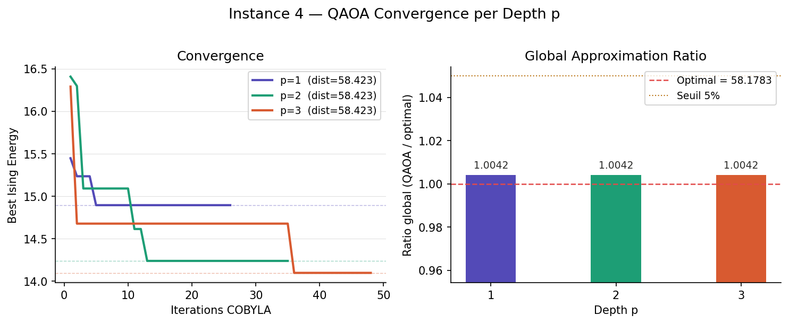
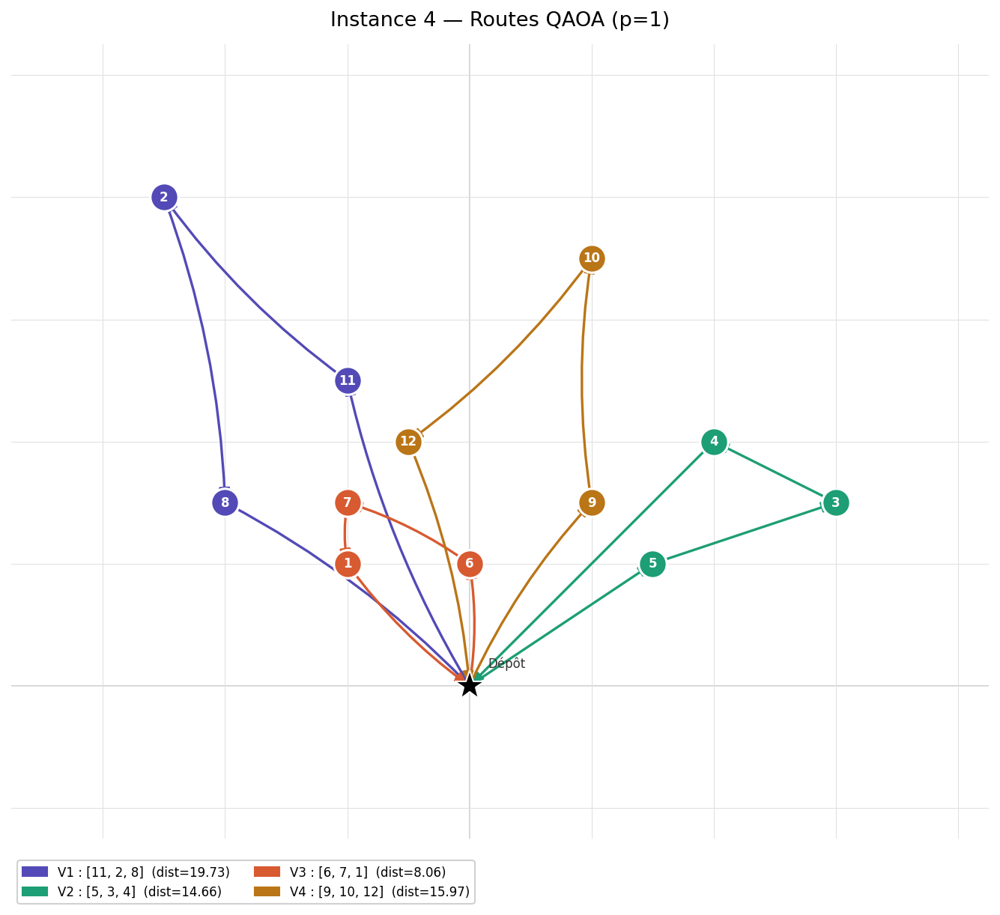
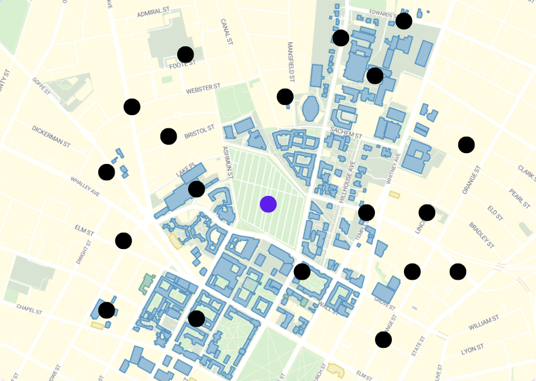
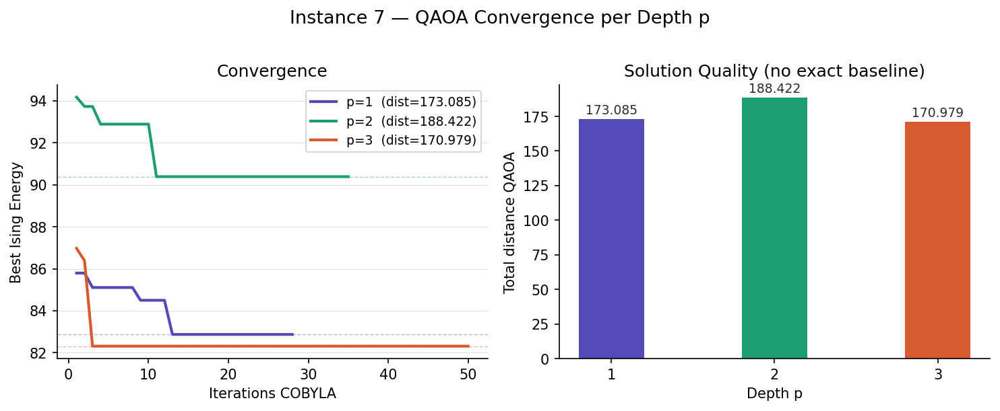
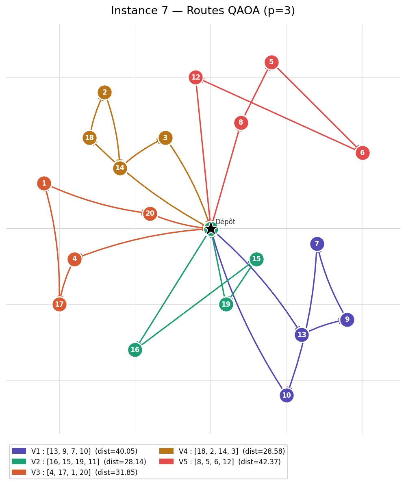

# 🚀 Quantum-CVRP: Fisher-Jaikumar Clustering + QAOA XY-Mixer
**Hackathon Submission: Quantum Couriers**

[QUANTUMCT](https://www.quantumct.org/) X [RTRC](https://www.rtx.com/who-we-are/we-are-rtx/transformative-technologies/rtrc) X [QBRAID](https://www.qbraid.com/)

## 👥 The Team: Quantum Command
We are **Quantum French Vanilla**, a multidisciplinary group from the University of Sherbrooke.

* **Florence** – MS.c Math
* **Julien-Pierre** – MS.c  Physics
* **Elisabeth** – MS.c  CS
* **Charles** – BS.c  Engineering
* **Jérôme** – BS.c  Physics

---

## 📌 Overview
This project tackles the **Capacitated Vehicle Routing Problem (CVRP)** using a hybrid quantum-classical pipeline. By decomposing the global problem into manageable clusters, we solve the **Traveling Salesperson Problem (TSP)** on each cluster using a **Quantum Alternating Operator Ansatz (QAOA)** equipped with an **XY-Mixer**.

Our approach focuses on **feasibility preservation**: unlike standard QUBO penalty methods that explore "illegal" states (like visiting two cities at once), our XY-Mixer restricts the quantum evolution to the valid permutation subspace.

---

## 📚 Technical Resources & Documentation
To understand the foundations of our implementation, refer to the following documentation:

* **The Qiskit Stack:** [Qiskit SDK Documentation](https://docs.quantum.ibm.com/) - The framework used for circuit building and statevector simulation.
* **QAOA Explained:** [Quantum Alternating Operator Ansatz](https://quantum.cloud.ibm.com/docs/en/tutorials/quantum-approximate-optimization-algorithm) - Details on the variational layer structure.
* **The TSP Problem:** [Traveling Salesperson Problem (Wikipedia)](https://en.wikipedia.org/wiki/Travelling_salesman_problem) - Background on the NP-hard combinatorial optimization challenge.
* **XY-Mixers in QAOA:** [Constraints in QAOA](https://arxiv.org/abs/1709.03489) - Research paper on the "Quantum Alternating Operator Ansatz" and specialized mixers.

---

## 🏗️ The Pipeline

### 1. Classical Clustering (Fisher-Jaikumar)
We use the **Fisher-Jaikumar** heuristic to solve the "Cluster-First" part of the VRP. 
- **Seed Selection:** We pick $K$ "seed" customers using a Maximin distance strategy to ensure vehicles are spread out.
- **Generalized Assignment:** Customers are assigned to seeds based on the **minimum insertion cost**:
  $$c_{ik} = d(0, i) + d(i, s_k) - d(0, s_k)$$
  where $d$ is Euclidean distance, $0$ is the depot, $i$ is the customer, and $s_k$ is the seed.
- **Constraints:** Assignments strictly respect the vehicle capacity.

### 2. Quantum Routing (QAOA + XY-Mixer)
For each cluster, we solve the TSP. We use **Position Encoding**: a qubit $x_{i,p}$ is $1$ if client $i$ is visited at stop $p$.

#### The Math
Instead of a standard $X$-mixer ($H_M = \sum \sigma_x$), we implement an **XY-Mixer**. 
The XY-mixer performs "partial swaps" between qubits:
$$U_{XY}(\beta) = e^{-i \beta (X_i X_j + Y_i Y_j)}$$

**Why XY?** In a TSP tour, each time step must have exactly one city. The XY-mixer preserves the **Hamming Weight** of the bitstring. If we start in a "one-hot" state (one city per stop), the quantum computer *only* explores other one-hot states. This drastically reduces the search space and removes the need for heavy constraint penalties.

### 3. Optimization & Warm Start
- **Optimizer:** We use the **COBYLA** classical optimizer to find the best angles $(\gamma, \beta)$.
- **Warm Start:** We initialize the circuit near a diagonal classical solution to speed up convergence.
- **Depth Sweep:** The solver automatically tests QAOA depths $p \in \{1, 2, 3\}$ to find the optimal balance between accuracy and gate noise.

---

## 📊 Problem Instances
We tested the solver on 6 distinct instances ranging from small-scale toy problems to complex 20-node distributions.

| Instance | Customers | Vehicles | Capacity | Complexity                           |
|:---------|:----------|:---------|:---------|:-------------------------------------|
| **1-2**  | 3         | 2        | 2-5      | Baseline sanity checks.              |
| **3**    | 6         | 3        | 2        | Multi-vehicle coordination.          |
| **4**    | 12        | 4        | 3        | High-density urban clustering.       |
| **7**    | 20        | 5        | 4        | Stress test for clustering & qubits. |

---

## 📈 Visualizations & Results

### Convergence Analysis
The solver generates convergence plots showing how the Ising energy decreases over classical iterations.

### Route Mapping
Final routes are reconstructed as: `Depot → Client A → Client B → Depot`.

---

## ☕️ French Vanilla coffee simulation

### The problem
We have 20 customers, 5 vehicles and each vehicle can hold only 4 cups.

### The solution
Final routes were found and our per-cluster ratio was calculated to be near-optimal.

---

## 🎛 Resource Usage

This resource usage table gives the biggest usage of resource between all clusters of the same instance problem.

| CVRP Instance # | # of Qubits | # of Gate Operations | Execution Time (s) | 
|:---------------:|:-----------:|:--------------------:|:------------------:|
|        1        |      9      |         360          |        11.3        | 
|        2        |      4      |          82          |        2.9         | 
|        3        |      4      |          82          |        7.4         | 
|        4        |      9      |         360          |        34.4        | 
|        7        |     16      |         964          |       1166.2       | 

---

## 🛠️ Technical Stack
- **Language:** Python 3.12+
- **Quantum Framework:** Qiskit (using `StatevectorSampler` for high-fidelity simulation)
- **Classical Optimization:** SciPy (`COBYLA`)
- **Visualization:** Matplotlib

## 🏁 Summary of Global Approximation
The project calculates a **Global Approximation Ratio**:
$$\alpha = \frac{\text{Total Distance (QAOA)}}{\text{Total Distance (Optimal Brute Force)}}$$
This metric allows us to benchmark exactly how much "Quantum Advantage" we are gaining (or how much noise we are fighting) compared to a perfectly solved classical baseline for each cluster. If the global ratio is too complex, we calculate the ratio for each cluster.

---
*Developed for the 2026 YQuantum Hackathon.*